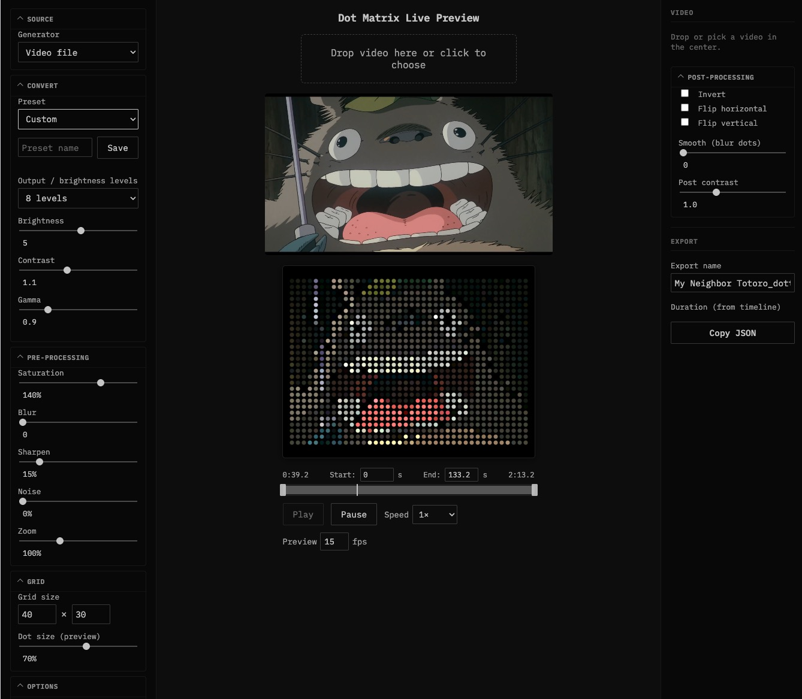

<div align="center">


# DotKonvert

**Convert videos to dot matrix animations with live preview and extensive customization**

[](https://YOUR_USERNAME.github.io/DotKonvert/)
[](https://www.python.org/)
[](LICENSE)

</div>

---

## ✨ Features

### 🎬 **Live Preview Web App**
- **100% browser-based** — No server required, runs entirely client-side
- Real-time preview with instant feedback
- Drag & drop video support
- Webcam input support
- Timeline editor with loop controls
- Export to JSON format compatible with HISE DotPnl

### 🎨 **8 Built-in Generators**
- **Video file** — Convert any video to dot matrix
- **Webcam** — Real-time camera input
- **Perlin noise** — Procedural animated noise
- **Waves** — Classic sine wave patterns
- **3D Waves** — Height-mapped waves with lighting
- **Vertex mesh** — Animated grid mesh
- **Plasma** — Classic plasma effect
- **Terrain** — Perlin-based terrain with directional lighting

### 🎨 **50+ Color Palettes**
- Extensive palette library for color-capable generators
- Categories: Nature, Sci-fi, Themes, and more
- Random palette picker
- Works with Perlin, Vertex, and Plasma generators

### ⚙️ **Advanced Processing**
- **Brightness levels:** 1-bit, 2, 4, 8, 16, or full continuous
- **Image processing:** Brightness, contrast, gamma, saturation
- **Pre-processing:** Blur, sharpen, noise, zoom
- **Post-processing:** Smooth, invert, flip, post-contrast
- **Dithering:** Floyd–Steinberg dithering for smooth gradients
- **Color mode:** Full RGB color support
- **Presets:** Save and load custom presets

### 🖼️ **Flexible Grid**
- Adjustable grid size (8–120 cols × 8–80 rows)
- Customizable dot size for preview
- Real-time grid updates

---

## 📸 Screenshot



---

## 🚀 Quick Start

### Option 1: Use the Live Preview (Recommended)

1. **Visit the live demo:** [GitHub Pages](https://YOUR_USERNAME.github.io/DotKonvert/)
2. **Load a video:** Drag & drop or click to select
3. **Tune settings:** Adjust brightness, contrast, grid size, etc.
4. **Export:** Click "Copy JSON" to get the dot matrix data

**No installation required!** Everything runs in your browser.

### Option 2: Python CLI Converter

For batch processing or command-line workflows:

```bash
# Clone the repository
git clone https://github.com/YOUR_USERNAME/DotKonvert.git
cd DotKonvert/video_to_dots

# Set up Python environment
python3 -m venv venv
source venv/bin/activate  # On Windows: venv\Scripts\activate
pip install -r requirements.txt

# Convert a video
python convert.py input.mp4

# With custom options
python convert.py input.mp4 \
  --start 30 \
  --duration 10 \
  --cols 60 \
  --rows 45 \
  --fps 15 \
  --dither \
  --output my_animation.json
```

### CLI Options

| Flag | Default | Description |
|------|---------|-------------|
| `--start` | `0` | Start time in seconds |
| `--duration` | `10` | Duration in seconds |
| `--fps` | `15` | Frames per second |
| `--cols` | `40` | Dot grid columns |
| `--rows` | `30` | Dot grid rows |
| `--threshold` | `128` | Brightness threshold (0–255) |
| `--dither` | — | Use Floyd–Steinberg dithering |
| `--invert` | — | Invert black/white |
| `--output` | `dot_video.json` | Output file path |

---

## 📖 Usage Examples

### Live Preview Web App

1. **Video Conversion:**
   - Select "Video file" generator
   - Drop your video
   - Adjust timeline start/end
   - Tune brightness, contrast, grid size
   - Click "Copy JSON"

2. **Procedural Generators:**
   - Select Perlin, Waves, Plasma, etc.
   - Enable "Color" for color-capable generators
   - Choose a palette from the dropdown
   - Click "Random" to try different palettes
   - Export when ready

3. **Custom Presets:**
   - Adjust all settings to your liking
   - Enter a preset name
   - Click "Save"
   - Load it anytime from the preset dropdown

### Python CLI

```bash
# Basic conversion
python convert.py video.mp4

# Extract a 5-second clip starting at 1:30
python convert.py video.mp4 --start 90 --duration 5

# High-resolution with dithering
python convert.py video.mp4 --cols 80 --rows 60 --dither

# Custom output file
python convert.py video.mp4 --output my_clip.json
```

---

## 📁 Project Structure

```
DotKonvert/
├── video_to_dots/
│   ├── live_preview.html      # Main web app
│   ├── live_preview.js        # App logic
│   ├── live_preview.css       # Styles
│   ├── convert.py             # Python CLI converter
│   ├── viewer.html            # JSON viewer
│   ├── favicon.svg            # App icon
│   └── requirements.txt       # Python dependencies
├── docs/                      # GitHub Pages deployment
│   ├── index.html
│   ├── live_preview.css
│   ├── live_preview.js
│   └── favicon.svg
├── screen.jpg                 # Screenshot
└── README.md                  # This file
```

---

## 🎨 Color Palettes

The live preview includes **50+ color palettes** for Perlin, Vertex, and Plasma generators:

- **Nature:** Sunset, Ocean, Forest, Fire, Ice, Aurora, Mint, Rose, Lavender, Emerald, Coral, Berry
- **Sci-fi:** Magma, Viridis, Plasma, Inferno, Cividis, Turbo, Neon, Electric, Matrix, Vaporwave, Synthwave
- **Themes:** Nord, Dracula, Monokai, Tokyo Night, One Dark
- **And many more!**

Use the "Random" button to discover new combinations.

---

## 🛠️ Tech Stack

- **Frontend:** Vanilla JavaScript, HTML5 Canvas, CSS3
- **Backend (CLI):** Python 3.8+, Pillow (PIL), FFmpeg
- **Deployment:** GitHub Pages (static hosting)

---

## 📝 Output Format

The exported JSON follows this structure:

```json
{
  "cols": 40,
  "rows": 30,
  "fps": 15,
  "frameCount": 150,
  "frames": [
    [0.0, 1.0, 0.0, 1.0, ...],  // Frame 1: cols × rows values
    [0.0, 0.0, 1.0, 1.0, ...],  // Frame 2
    ...
  ],
  "colorMode": false  // Optional: true if RGB color
}
```

Each frame is a flat array of `cols × rows` values:
- **Grayscale:** `0.0` (black) to `1.0` (white)
- **Color:** `[r, g, b]` arrays, each `0.0` to `1.0`

Values are stored row-by-row, left-to-right, top-to-bottom.

---

## 🌐 Deployment

The live preview is deployed on **GitHub Pages**. See [`DEPLOY.md`](DEPLOY.md) for detailed deployment instructions.

**Quick deploy:**
1. Push the repo to GitHub
2. Go to Settings → Pages
3. Set source to `main` branch, `/docs` folder
4. Your site will be live at `https://YOUR_USERNAME.github.io/DotKonvert/`

---

## 📄 License

This project is licensed under the MIT License.

---

## 🙏 Credits

- Built with vanilla JavaScript and modern web APIs
- Uses [IBM Plex Mono](https://fonts.google.com/specimen/IBM+Plex+Mono) font
- Inspired by retro dot matrix displays and HISE DotPnl component

---

<div align="center">

**Made with ❤️ for dot matrix enthusiasts**

[Report Bug](https://github.com/YOUR_USERNAME/DotKonvert/issues) · [Request Feature](https://github.com/YOUR_USERNAME/DotKonvert/issues) · [View Demo](https://YOUR_USERNAME.github.io/DotKonvert/)

</div>
